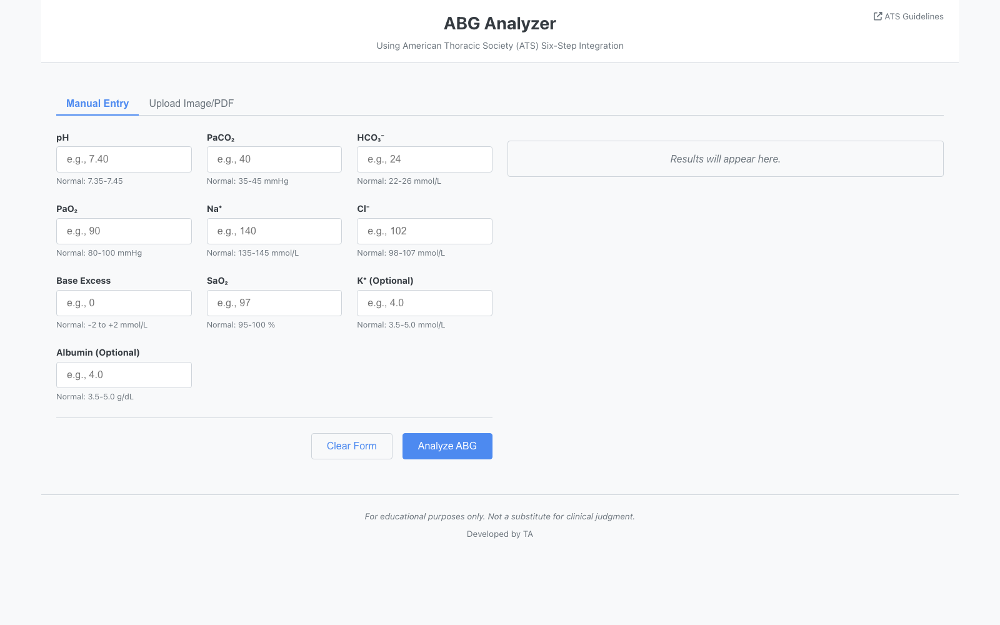

# ABG Analyzer



ABG Analyzer is a React-based arterial blood gas interpretation tool that walks users through the American Thoracic Society six-step method. It supports manual ABG entry, image/PDF upload, camera capture, OCR-assisted value extraction with Gemini, anion gap correction, delta ratio interpretation, and printable analysis reports.

> Educational use only. This tool is not a substitute for clinical judgement, local policy, or specialist review.

## Features

- Manual entry for pH, PaCO2, HCO3, PaO2, sodium, chloride, base excess, SaO2, potassium, and albumin
- Image, PDF, pasted image, and camera workflows for extracting ABG values
- Gemini-powered OCR with editable extracted values before analysis
- ATS-style six-step ABG interpretation
- Internal consistency check using Henderson-Hasselbalch
- Compensation assessment including Winter's formula and respiratory compensation rules
- Anion gap calculation with albumin correction
- Delta ratio analysis for high anion gap metabolic acidosis
- Printable ABG analysis report

## Tech Stack

- React 19
- Vite 6
- PDF.js
- Font Awesome
- Gemini 1.5 Flash API

## Getting Started

### Prerequisites

- Node.js 18 or newer
- npm
- Gemini API key for image/PDF OCR workflows

### Installation

```bash
git clone https://github.com/tufayl-ahmed/abg-analyzer.git
cd abg-analyzer
npm install
```

Create a local environment file:

```bash
cp .env.example .env
```

Then add your Gemini API key:

```bash
VITE_GEMINI_API_KEY=your_gemini_api_key_here
```

Start the development server:

```bash
npm run dev
```

Open the local URL shown in your terminal, usually:

```text
http://localhost:5173/
```

## Available Scripts

```bash
npm run dev
```

Runs the Vite development server.

```bash
npm run build
```

Builds the production-ready app into `dist/`.

```bash
npm run preview
```

Serves the production build locally for preview.

## How It Works

1. Enter ABG values manually or upload/capture an ABG report image.
2. If an image or PDF is used, Gemini extracts likely ABG values as JSON.
3. Review and edit extracted values before running the calculation.
4. The analyzer checks internal consistency, acid-base status, primary disorder, compensation, anion gap, and delta ratio.
5. Results are shown as a final interpretation plus step-by-step reasoning.

## Project Structure

```text
src/
  components/
    FileUpload.jsx
    ManualInputForm.jsx
    ResultsDisplay.jsx
    Tabs.jsx
  utils/
    abgCalculator.js
  App.jsx
  main.jsx
```

## Environment Variables

| Variable | Required | Purpose |
| --- | --- | --- |
| `VITE_GEMINI_API_KEY` | Yes, for OCR workflows | Sends uploaded/captured ABG images to Gemini for structured value extraction |

Manual ABG entry works without a Gemini key. Upload, paste, PDF, and camera analysis require the key.

## Notes

- Do not commit `.env` files or real API keys.
- If a key was previously committed to a public repository, revoke it and create a new one.
- Interpretation logic is intended for learning and decision support, not autonomous clinical decision-making.
